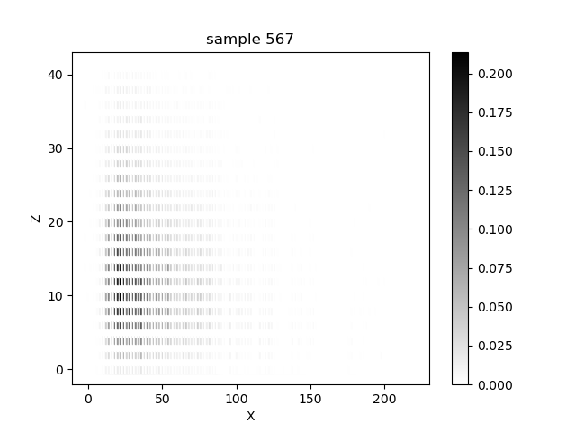
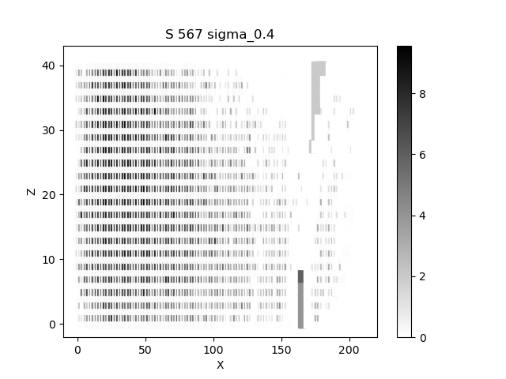
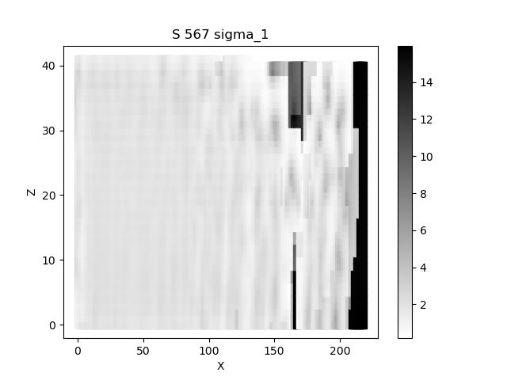
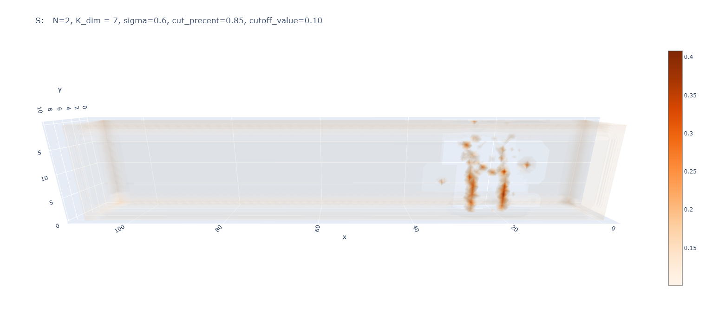

# Weight-Shape decomposition

## Summary
This project is meant to apply the methods given in the following [article](https://www.sciencedirect.com/science/article/pii/S0031320318301249?via%3Dihub)
on the positron showers dataset and display the shape component generated.

## Requirements
plotly>=5.4.0
matplotlib>=3.5.0
numpy>=1.20.3
torch>=1.10.0
scipy>=1.6.3

## Data

* The data files are a list of energy values deposited in the pads of the calorimeter.
    The pads are indexed in an (x,y,z) format.
* Data was generated artificially using monte-carlo methods.
* Data labels for each calorimeter sample there are: (all values are continuous)
    - For 'IP0*' files (multiple showers):
        * A list of the energy value in GeV for each shower.
    
* The two files are IP03 and IP05: 
    - IP05 contains samples with number of showers ranging between 1~300
    - IP03 contains samples with number of showers ranging between 10~3000
    
* The Excel files containg the index of sample and the number of showers in it.

## Code
* The decomposition can be done in two methods:
    1. The full space decomposition. Using the Psy, Prob, Entropy and Potential functions in the file.
    The process is very slow since each point in the new space has to sum over ~20,000 points from the data space.
       
    2. The convolutional method. The code is currently using this method, generating two kernels as defined in the article and convolving them with the data.
    
## Display

* There are two display method we explored:
    1. Using [Potly](https://www.sciencedirect.com/science/article/pii/S0031320318301249?via%3Dihub) we display the full 3D image of the sample and the Shape decomposition.
    2. Summing over the Y axis to generate a 2D image.
    
* Both methods are controlled by the 'disp' parameter.

## Results

Result examples:

2D representation of a sample with 567 showers.          |  2D representation of the Shape component of the same sample with sigma0.4 | Same with sigma=1
:-------------------------:|:-------------------------: |:-------------------------:
|   |   |

3D image of a sample with 2 showers           |  S component of the same sample with sigma=0.6
:-------------------------:|:-------------------------:
  |   |  

For a full 3D sample open the N=5.html file.

